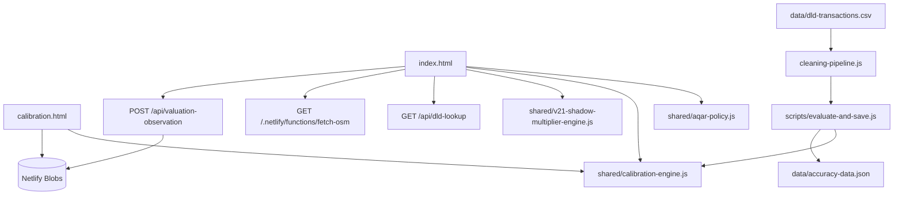

# دليل المطورين لمنصة MIAYAAR

## Valuation Intelligence Engine

**الإصدار:** دليل تقني — 27 أغسطس 2026

**النطاق:** البنية الحالية في `main`، مع الحفاظ على عقود AQAR الداخلية والمعرّفات الحالية.

> هذا الدليل يصف السلوك البرمجي الحالي كما هو. لا يُعد اقتراحًا لتغيير الخوارزميات أو المعايرة، ولا ينبغي تفسير أي معامل حالي على أنه قرار منهجي جديد.

## 1. نظرة عامة

MIAYAAR منصة ثابتة مبنية باستخدام HTML وCSS وVanilla JavaScript، وتُنشر على Netlify. لا تستخدم React أو bundler لتجميع الواجهة العامة. تعتمد الواجهة على ملفات JavaScript مشتركة، بينما تنفذ Netlify Functions حدود API وعمليات الوصول إلى البيانات الخارجية والتخزين.

المشروع له مساران حسابيان يجب إبقاؤهما متميزين:

| المسار | الغرض | نقطة الدخول الرئيسية |
|---|---|---|
| **Interactive browser path** | تقييم المستخدم داخل المتصفح وإظهار النتيجة فورًا. | `index.html` |
| **Batch / Accuracy path** | إعادة تقييم معاملات DLD وإنشاء artifacts الرسمية والتشخيصات. | `scripts/evaluate-and-save.js` |

توجد قواعد مشتركة بين المسارين، أهمها سياسة أنواع العقارات، محرك المعايرة، تنظيف DLD، ومحرك Shadow. لكن بعض القيم أو طرق التقييم تختلف بين interactive وbatch، لذلك يجب عدم توحيدهما تلقائيًا دون قرار منهجي واختبارات مقارنة.

## 2. خريطة المستودع

| المسار | المسؤولية |
|---|---|
| `index.html` | النموذج العام، الخريطة، استدعاء DLD/GIS، الحساب التفاعلي، وعرض النتيجة. |
| `calibration.html` | Calibration Console الإدارية وتحميل/تحرير/حفظ configuration. |
| `accuracy-dashboard.html` | عرض Accuracy وملخصات التشخيص الرسمية. |
| `market-intelligence.html` | عرض مؤشرات Market Intelligence وسياقها. |
| `export.html` | مسار التصدير العام. |
| `shared/aqar-policy.js` | أنواع العقارات، قابلية المناهج، الحقول المطلوبة وغير المنطبقة. |
| `shared/calibration-engine.js` | حساب Income وCost وDCF ودمج نتائج المناهج بالأوزان. |
| `shared/aqar-calibration-defaults.js` | schema الافتراضي، أنواع العقارات، الأوزان والمعاملات الأساسية. |
| `shared/calibration-validation.js` | التحقق من configuration والأوزان وShadow والحقول الرقمية. |
| `shared/v21-shadow-multiplier-engine.js` | المسار التجريبي المعزول لمعاملات المشروع وBUA/Plot والتجديد. |
| `shared/property-extra-fields.js` | ظهور والتحقق من حقول Project وBUA وPlot وLast Renovation. |
| `shared/evidence-state.js` | تصنيف حالة الأدلة: `ready` و`limited` و`insufficient` و`unavailable`. |
| `shared/dld-evidence-cleaning.js` و`scripts/cleaning-pipeline.js` | تنظيف والتحقق من أهلية سجلات DLD. |
| `shared/comparable-diagnostics.js` | إنشاء تشخيصات مستويات المقارنة والتشتت. |
| `shared/district-map-linking.js` | ربط أسماء المناطق بنقاط الخريطة والمطابقة العكسية. |
| `netlify/functions/` | API وعمليات التخزين والوصول إلى DLD وGIS. |
| `scripts/` | جلب البيانات، التنظيف، التقييم الدفعي، التشخيصات، والاختبارات المعزولة. |
| `tests/` | اختبارات Node للعقود الحساسة وواجهات API والسلوك العام. |
| `data/` | artifacts وملخصات البيانات؛ بعض الملفات رسمية ومحمية. |

## 3. البنية التشغيلية



ملف `netlify.toml` يحدد مجلد Functions ويضيف redirect عامًا من `/api/*` إلى `/.netlify/functions/:splat`. لذلك يمكن للواجهة استخدام `/api/calibration-config` و`/api/valuation-observation`، بينما تستخدم بعض الاستدعاءات القديمة أو المباشرة مسار `/.netlify/functions/...` صراحة.[1]

## 4. عقود أنواع العقارات والمناهج

توجد أنواع العقارات في `shared/aqar-policy.js` و`shared/aqar-calibration-defaults.js`، ولا ينبغي إضافة نوع جديد من ملف واحد فقط.

| النوع | Interactive methods | Batch methods الحالية |
|---|---|---|
| `apartment` | `sales-comparison`, `income`, `dcf` | `sales-comparison`, `income` |
| `villa` | `sales-comparison`, `income`, `cost`, `dcf` | `sales-comparison`, `income`, `cost` |
| `townhouse` | `sales-comparison`, `income`, `cost`, `dcf` | `sales-comparison`, `income`, `cost` |
| `office` | `sales-comparison`, `income`, `cost`, `dcf` | `sales-comparison`, `income`, `cost` |
| `retail` | `sales-comparison`, `income`, `cost`, `dcf` | `sales-comparison`, `income`, `cost` |
| `warehouse` | `sales-comparison`, `income`, `cost` | `sales-comparison`, `income`, `cost` |
| `land` | `sales-comparison`, `income` | `sales-comparison`, `income` |

تستخدم `getApplicableMethods(propertyType, context)` قيمة `batch` فقط عندما يساوي السياق `'batch'`؛ أي سياق آخر يعيد قائمة interactive. هذا التفصيل مهم عند إضافة endpoint أو اختبار جديد.

`validatePropertyInput()` يفرض نوعًا مدعومًا ومساحة لا تقل عن `10` مترًا مربعًا. أما الحقول الأخرى فتظل اختيارية أو غير منطبقة وفق `PROPERTY_POLICY`.[2]

## 5. تدفق التقييم التفاعلي

يبدأ التدفق داخل `index.html` كما يلي:

1. تُجمع المدخلات عبر `collectPropertyData()`، مع تصفير أو إخفاء الحقول غير المنطبقة حسب نوع العقار.
2. يختار المستخدم District / Area، ويمكن للواجهة تحديث مركز الخريطة والمرافق القريبة.
3. يستدعي المستخدم **Load market data**، فتُرسل المنطقة والنوع والمساحة، مع الإحداثيات عند توفرها، إلى DLD lookup.
4. تُخزن نتيجة السوق في `scrapedDistrictData`، وتُصنف حالة الأدلة عبر `shared/evidence-state.js`.
5. تُحسب الطرق المتاحة: Sales Comparison، Income، Cost، وDCF بحسب النوع والمدخلات.
6. تُجمع النتائج عبر عقد محرك المعايرة المشترك، ثم يحسب المسار التفاعلي نسبة الثقة ويعرض النتيجة.
7. يحسب محرك Shadow قيمة تجريبية منفصلة إن كان مفعّلًا؛ لا يستبدل ذلك القيمة الرسمية.
8. إذا كانت موافقة التحليل الاختيارية مفعلة، يُرسل observation بعد اكتمال التقييم. فشل التسجيل لا يحجب نتيجة التقييم.

لا يجوز الاحتفاظ بنتيجة قديمة بعد بدء تقييم أو تحميل أدلة لعقار مختلف. عند تغيير المدخلات المهمة، يجب إعادة تحميل بيانات السوق قبل تفسير النتيجة.

## 6. خوارزميات التقييم التفاعلي

### 6.1 Sales Comparison

في المسار التفاعلي، تبدأ الطريقة من `avgPriceSqm` الناتج عن DLD lookup أو من بيانات السوق المحملة، ثم:

```text
base = avgPricePerSqm × Total Area
base = min(base, sales.maxPricePerSqm × Total Area)
```

بعد ذلك تُطبّق المعاملات المتاحة بالترتيب التشغيلي في `salesComparisonApproach()`:

| المرحلة | التأثير |
|---|---|
| Studio | يطبق `noBedroomMultiplier` عندما يكون عدد الغرف صفرًا للشقق. |
| Condition | يطبق `conditionFactors[condition]`. |
| Age | يطبق `max(minimumAgeMultiplier, 1 − age × ageDepreciation)`. |
| Features | يضيف `features.length × area × featureBonusPerSqm`. |
| Finish | يطبق `finishFactors[finishQuality]` عند وجوده. |
| View | يحسب `calculateViewMultiplier()` للإطلالات المتعددة مع معامل الإطلالة الثانوية وحدود min/max. |
| Floor | يطبق `floorFactors[floorLevel]` عند وجود الطابق. |
| Street | يطبق `streetFactors[streetPosition]` عند وجوده. |
| Building | يطبق `buildingConditionFactors[buildingCondition]`. |
| Furnished | يطبق `furnishedFactors[furnishedStatus]`. |
| GIS | يضرب القيمة بمضاعف الموقع عندما يكون أثر GIS موجبًا. |

هذه الطريقة لا تنشئ سعرًا من DLD عندما لا تتوفر قيمة سوقية صالحة. حالة الأدلة تُعرض منفصلة عن المعادلة.

### 6.2 Income Capitalization

تتطلب الطريقة قيمة موجبة لـ`annualRent`:

```text
expenses = annualExpenses || annualRent × expenseRate
NOI = annualRent × (1 − vacancyRate / 100) − expenses
value = NOI / (capRate / 100)
```

إذا كانت `annualExpenses` فارغة، يستخدم المسار `expenseRate` كافتراض. وقد تستخدم الواجهة `vacancyRate` و`capRate` من بيانات الاستشارة عند توفرها، وإلا تستخدم معاملات المعايرة الحالية. إذا كان NOI غير موجب، تعيد الطريقة `null` في المسار التفاعلي أو `NOT_APPLICABLE` في المحرك المشترك.

### 6.3 Cost Approach

لا يستخدم المسار التفاعلي Cost للشقق والأراضي. للأنواع الأخرى:

```text
build = constructionCostPerSqm × area
land = supplied landValue
     || avgPriceSqm × area × landValueFromMarketShare
     || build × landValueFromBuildShare
age = clamp(currentYear − yearBuilt, 0, 50)
depreciation = min(maximumDepreciation, age × depreciationPerYear)
value = (land + build) × (1 − depreciation) × conditionFactor
```

اختيار مصدر Land Value مهم؛ القيمة المدخلة صراحة تتقدم على القيمة المشتقة من السوق أو البناء.

### 6.4 DCF

لا يستخدم DCF إلا إذا كان منطبقًا على النوع ووجد `annualRent` موجب. يحدد `currentValue` من `avgPriceSqm × area` عند وجوده، أو من `annualRent / fallbackCapRate` عند غيابه. ثم يُحدّث الإيجار والقيمة سنة بعد سنة:

```text
NPV = −currentValue
for year = 1..years:
  rent = rent × (1 + rentGrowthRate)
  value = value × (1 + valueGrowthRate)
  NPV += rent × netOperatingIncomeRate / (1 + discountRate)^year
  if final year:
    NPV += value × terminalValueRate / (1 + discountRate)^years
result = NPV > 0 ? NPV : currentValue × negativeNpvFallback
```

يجب الحفاظ على الفرق الحالي بين DCF في interactive وbatch إلى أن يصدر قرار منهجي، لأن قائمة القابلية تختلف بين السياقين.[2]

### 6.5 دمج المناهج

يحوّل `calculateWeightedValue()` أسماء الطرق التفاعلية إلى مفاتيح المحرك المشترك، ثم يستدعي `buildMethodResults()` و`combineMethodResults()`.

يستبعد الدمج أي نتيجة ليست `APPLIED` أو لا تملك قيمة رقمية موجبة أو وزنًا موجبًا. قيمة الدمج هي متوسط موزون مُطبّع على مجموع أوزان الطرق المطبقة فقط:

```text
applied = results where status == APPLIED and weight > 0
value = Σ(result.value × methodWeight) / Σ(methodWeight)
```

إعادة التطبيع على الطرق المطبقة فقط تعني أن طريقة معتمدة قد لا تسهم في نتيجة معينة إذا كانت مدخلاتها غير موجودة. في هذه الحالة تُسجل `NOT_APPLICABLE` أو `NOT_USED` حسب المسار بدل إعطائها قيمة صفرية مضللة.[3]

## 7. DLD API ومسار المقارنات

### Endpoint

المسار العام هو:

```http
GET /api/dld-lookup?district=Business%20Bay&propertyType=apartment&area=120
```

تقبل Function أيضًا المسار المباشر `/.netlify/functions/dld-lookup`. المعاملات المطلوبة هي `district` و`propertyType` و`area`. قد تمرر الواجهة `lat` و`lng` مع الطلب، لكن handler الحالي لا يستخدمهما في `adaptiveSearch`؛ البحث الحالي يعتمد على اسم المنطقة والنوع وفئة المساحة.

| الحالة | السلوك |
|---:|---|
| `200` مع `found: true` | توجد مقارنات قابلة للاستخدام. |
| `200` مع `found: false` | لم توجد عينة كافية، دون إنشاء سعر DLD مختلق. |
| `400` | معاملة ناقصة أو نوع غير مدعوم أو مساحة غير صالحة. |
| `405` | method غير GET. |
| `429` | تجاوز حد الطلبات، مع `Retry-After`. |
| `502` أو `503` | مصدر DLD غير متاح أو أعاد بيانات غير صالحة. |

### البحث التكيفي

بعد تحميل البيانات وتطبيق `applyAllFilters()`، يحسب endpoint فئة المساحة ويجرب مستويات البحث التالية:

| المستوى | شروط التجميع |
|---|---|
| `district_size` | District + property type + size category، مع مطابقة نصية مرنة للمنطقة. |
| `district_type` | District + property type، دون size category. |
| `district_only` | District فقط، مع أي نوع عقار. |

لكل مستوى تُجرب نوافذ زمنية `[30, 60, 90, 180, 365, 730, Infinity]` يومًا، ويُقبل المستوى عندما توجد خمس معاملات على الأقل. تُعدّل أسعار المتر زمنيًا باستخدام متوسط النمو الشهري، ثم يُختار weighted median. تُعاد `avgPricePerSqm` و`comparablePrices` و`count` و`timeWindow` و`confidence` و`level`.

يستخدم endpoint cache لمدة خمس دقائق وحدًا أقصى 60 طلبًا لكل مفتاح عميل خلال دقيقة، مع حماية من تضخم مفاتيح rate limit. يجب ألا تُزال هذه الحدود عند إضافة استدعاء جديد.

## 8. تنظيف DLD وAccuracy batch

`cleaning-pipeline.js` هو المصدر المشترك لدوال التنظيف ولا ينبغي نسخها في Function أو script آخر. مراحل `applyAllFilters()` الحالية هي:

1. قبول سجلات evidence المؤهلة.
2. استبعاد الإجراءات غير السوقية والكلمات الدالة على gift أو inheritance أو mortgage وغيرها.
3. رفض السجلات ذات District أو النوع أو المساحة أو السعر المفقود.
4. فحص توافق `area` مع `procedureArea` ضمن نسبة `0.5` إلى `2.0` عندما يتوفر الحقلان.
5. تطبيق حدود المساحة حسب نوع العقار.
6. اشتقاق `pricePerSqm` واستبعاد الأسعار غير الصالحة.
7. إزالة outliers داخل مجموعات `district × propertyType` باستخدام log-IQR.
8. استبعاد off-plan والحالات غير الجاهزة.
9. إزالة التكرارات باستخدام `propertyRef` ومفتاح تاريخ/مساحة/سعر تقريبي.
10. استبعاد ultra-luxury فوق حدود السعر الحالية.
11. الإبقاء على المجموعات التي تحقق حد المجموعة النهائي.

مسار `scripts/evaluate-and-save.js` يبني lookup tables وleave-one-out medians، ثم يختار للمقارنة الدفعيّة بالترتيب:

```text
project + size   if count >= 3
project          if count >= minProject (retail=2, otherwise=5)
district + size  if count >= 5
district         if count >= 5
no result        otherwise
```

بعد اختيار المجموعة يطبق طبقة الاستشارة، ثم View وGIS عند توفرهما، ثم يمرر القيمة إلى محرك المعايرة المشترك لإنتاج `methodResults` و`calibrationId` و`assumptions`.

يكتب المسار الدفعي artifacts مثل `market-data.json` و`dld-price-lookup.json` و`accuracy-data.json` وملفات التشخيص والملخصات. لا تشغّل `npm run evaluate` أثناء التحقيق العادي؛ فهو مسار كتابة وقد يعيد إنشاء artifacts.

## 9. GIS API

المسار المباشر المستخدم في الواجهة هو:

```http
GET /.netlify/functions/fetch-osm?lat=25.1855&lng=55.2604&radius=1000
```

يمكن أيضًا استخدام `/api/fetch-osm` وفق redirect العام. تقبل Function إحداثيات داخل حدود خدمة دبي ونصف قطر بين `100` و`5000` متر.

تستخدم Function:

- cache داخليًا لمدة سبعة أيام وبحد أقصى 250 مفتاحًا.
- استعلامات Overpass متعددة الخوادم مع مهلة كلية تقارب 20 ثانية.
- Haversine لحساب المسافة.
- أنواع مرافق مثل Metro وMall وSupermarket وSchool وHospital وPark وغيرها.
- وزنًا لكل نوع ومساهمة تعتمد على المسافة وعدد العناصر، مع سقف للنقاط.

تعيد الاستجابة `facilities` و`pois` و`totalScore` و`count` و`lat` و`lng` و`radius` و`source`. فشل GIS يعيد حالة صريحة؛ لا يجوز تحويل غياب البيانات إلى مرافق مصطنعة أو premium ضمني.[4]

## 10. Calibration configuration API

### GET العام

```http
GET /api/calibration-config
```

يعيد configuration النشط دون كشف token الإدارة. `?history=true` يطلب أيضًا history لكنه يتطلب Authorization.

### GET history

```http
GET /api/calibration-config?history=true
Authorization: Bearer <admin-token>
```

### POST الحفظ

```http
POST /api/calibration-config
Authorization: Bearer <admin-token>
Content-Type: application/json

{
  "config": {
    "propertyTypes": {
      "villa": {
        "weights": {
          "sales-comparison": 0.50,
          "income": 0.25,
          "cost": 0.15,
          "dcf": 0.10
        }
      }
    }
  }
}
```

القيمة أعلاه مثال بنيوي فقط وليست توصية معايرة. عند وصول POST:

1. تُقرأ defaults وconfiguration الحالية.
2. يطبّق `deepMergeKnown()` على المفاتيح المعروفة فقط.
3. يُنشأ `configId` جديد بصيغة `cal-${Date.now()}`.
4. تُثبت الحالة `active` ووقت التحديث ونسخة المحرك.
5. تُشغّل `validateConfig()`.
6. عند النجاح تُحفظ configuration في Netlify Blobs تحت store `aqar-calibration` والمفتاح `active`.
7. يُضاف سجل مختصر إلى `history/index` وتُحفظ نسخة تفصيلية تحت `history/<configId>`.
8. يُحتفظ بآخر 50 سجل history.

| الحالة | المعنى |
|---:|---|
| `200` | قراءة ناجحة أو حفظ ناجح. |
| `400` | configuration غير صالحة. |
| `401` | token مفقود أو غير صحيح في history/POST. |
| `405` | method غير مدعوم. |
| `503` | POST مستحيل لأن `AQAR_ADMIN_TOKEN` غير مضبوط. |
| `500` | فشل قراءة أو كتابة التخزين. |

لا تطبع token في logs، ولا تستخدمه في الاختبارات المحلية، ولا تضف endpoint إداريًا جديدًا دون مراجعة حدود المصادقة.

## 11. Validation contract

`validateConfig()` يتحقق من:

- `schemaVersion === 1`.
- وجود جميع أنواع العقارات السبعة.
- أن كل وزن رقمي بين `0` و`1`.
- أن مجموع الأوزان المعتمدة لكل نوع يساوي `1.0` ضمن tolerance قدره `0.000001`.
- أن وزن الطريقة غير المعتمدة يساوي صفرًا.
- عدم وجود method غير معروف في `applicableMethods`.
- أن أوراق GIS الرقمية finite.
- أن Shadow enabled منطقية، وحدود multiplier موجبة، وbands مرتبة وغير فارغة.
- أن Project multipliers وband multipliers موجبة.

`deepMergeKnown()` يتجاهل المفاتيح غير المعروفة بدل تمريرها إلى configuration. توجد معاملة خاصة لـ`projectMultipliers` حتى تُدمج المفاتيح الديناميكية دون استبدال الكائن كاملًا.[5]

## 12. Shadow v2.1

`v21-shadow-multiplier-engine.js` مسار تجريبي مستقل، ولا يغير القيمة الرسمية عندما يكون `enabled` false. الأنواع التي يمكن أن تستفيد من Project هي Apartment وVilla وTownhouse، بينما BUA/Plot مخصصان لـVilla وTownhouse، والتجديد مخصص للأنواع السكنية الثلاثة.

عند التفعيل، يحسب المحرك:

```text
combinedRaw = projectBuilding × buaPlotArea × lastRenovation
combined = clamp(combinedRaw, combinedMinimumMultiplier, combinedMaximumMultiplier)
```

يطبّق Project multiplier فقط إذا كان الاسم اقتراح DLD موثقًا ووصل `projectEvidenceCount` إلى الحد الأدنى. يحل BUA/Plot band نسبة `bua / plotArea`، وتحل Renovation band عمر التجديد من `currentYear - lastRenovationYear`.

تعيد `compute()` `multiplier` و`rawMultiplier` و`factors` و`applied` و`skipped` و`bounds`. يجب الاحتفاظ بسبب skip في trace؛ فهو جزء من قابلية تفسير التجربة، وليس خطأً يجب إخفاؤه.[6]

## 13. Observation API

الملاحظات اختيارية ولا ينبغي أن تدخل Accuracy أو calibration history. المسار:

```http
POST /api/valuation-observation
Content-Type: application/json
```

يشترط endpoint:

- method POST فقط.
- same-origin عندما تتوفر origin وhost headers.
- body لا يتجاوز `32 KiB`.
- `consent.analytics === true`.
- نوع عقار مدعوم وDistrict غير فارغ.
- صحة السنة والحقول الإضافية وانطباقها.
- تحقق Project verified من `dld-project-evidence-index.json` عند استخدام `verified-dld`.
- `baselineValue` و`shadowValue` موجبتين.
- `evidenceState` ضمن الحالات المعروفة.

تُطبع البيانات قبل التخزين في schema `v2.1-observation-1` وتُحفظ في Netlify Blobs store `aqar-input-observations` تحت:

```text
events/YYYY/MM/<observationId>.json
```

لا تُحفظ أسماء أو بريد أو هاتف أو Authorization headers أو tokens. إذا لم توجد موافقة صريحة، يجب أن يرفض endpoint الطلب قبل التخزين.[7]

## 14. الأدلة والتشخيصات

`evidence-state.js` يفصل بين حالة وجود أدلة السوق وحساب القيمة. لا ينبغي استخدام كلمة confidence بمعنى واحد في جميع المسارات؛ فـDLD lookup وواجهة النتيجة وMarket Intelligence قد تستخدم مؤشرات مختلفة.

`comparable-diagnostics.js` يختار أعلى مستوى مقارنة مؤهلًا بين:

```text
project_size → project → district_size → district
```

ثم يعيد counts وqualification flags وملخصات price-per-sqm وتشتت المقارنة. flags مثل `moderate_peer_dispersion` و`high_peer_dispersion` و`land_xlarge` تشخيصية ولا تغير القيمة الحالية.[8]

يجب أن تتضمن النتائج القابلة للتدقيق على الأقل:

| الحقل | الغرض |
|---|---|
| `calibrationConfigId` | تحديد إصدار المعايرة المستخدم. |
| `engineVersion` | تحديد نسخة منطق التقييم. |
| `valuationMethods` أو `methodResults` | معرفة الطرق المطبقة وغير المطبقة. |
| `calibrationAssumptions` أو `assumptions` | فصل الافتراضات عن source facts. |
| `gisMultiplier` و`viewMultiplier` | تتبع تعديلات الموقع والإطلالة. |
| `comparableDiagnostics` | تفسير مستوى المقارنة وجودتها. |

## 15. أوامر التطوير

```bash
npm ci
npm test
npm run build
npm run validate-artifacts
npm run validate-dld
npm run mobile-smoke
npm run calibration-impact-matrix
npm run reproducibility-drift
```

| الأمر | ملاحظات |
|---|---|
| `npm test` | يشغّل اختبارات Node في `tests/*.test.js`. |
| `npm run build` | لا يوجد build فعلي؛ يطبع تأكيدًا للمشروع الثابت. |
| `npm run validate-artifacts` | يتحقق من provenance وintegrity للـDLD وAccuracy والملخصات. |
| `npm run validate-dld` | يتحقق من تنظيف DLD ومنع rejected leakage. |
| `npm run mobile-smoke` | يشغّل Playwright على Pixel 5 وiPhone 13 emulation. |
| `npm run calibration-impact-matrix` | اختبار محلي read-only لتأثير الأوزان والمعاملات، دون POST أو حفظ. |
| `npm run reproducibility-drift` | تجربة معزولة لإعادة الإنتاج وdate drift. |
| `npm run evaluate` | مسار كتابة artifacts؛ لا تشغله للتحقيق السريع. |
| `npm run fetch` | قد يجلب ويعيد بناء بيانات؛ راجع script قبل التشغيل. |

قبل PR يجب تشغيل الاختبارات، syntax check للـinline JavaScript، `git diff --check`، وحارس artifacts. عند تعديل API أو الواجهة، أضف اختبارًا يثبت العقد الجديد ولا تكتفِ بفحص يدوي.

## 16. الاختبارات وقواعد التغيير

اختبارات المشروع موزعة حسب العقد، ومنها:

| الملف | نطاق الاختبار |
|---|---|
| `calibration-engine.test.js` | أثر الأوزان ومعاملات Income على القيمة. |
| `calibration-config.test.js` | validation وقاعدة 100% وShadow configuration. |
| `calibration-matrix.test.js` | توافق أنواع العقارات مع المناهج وسياسة الواجهة. |
| `calibration-impact-matrix.test.js` | عزل الاختبار المحلي وعدم لمس artifacts. |
| `dld-lookup-validation.test.js` و`dld-lookup-history.test.js` | مدخلات DLD والبحث الزمني. |
| `dld-evidence-cleaning.test.js` | أهلية وتنظيف DLD. |
| `v21-shadow-multiplier-engine.test.js` | Project وBUA/Plot وRenovation والحدود. |
| `valuation-observation.test.js` | consent وsame-origin وschema والحقول الإضافية. |
| `security-headers-a11y.test.js` | headers وskip links وmain landmarks. |
| `public-ui-regression.test.js` | سلوك الواجهة العامة والنتيجة. |

عند تعديل evaluator أو calibration يجب توضيح ما إذا كان التغيير يؤثر في التقييمات الجديدة فقط أو يعيد بناء Accuracy. لا تُعدّل `data/accuracy-data.json` أو `data/dld-transactions.json` يدويًا أثناء إصلاح اختبار، ولا تستخدم نتيجة Accuracy لتبرير معامل جديد دون validation زمني وقطاعي مستقل.

## 17. قواعد الأمان والنشر

يجب أن تبقى Admin token في environment secret فقط. لا تستخدم Admin token في local fixtures أو CI output. لا تفعّل legacy scraper endpoints (`scrape.js` و`scrape-sold.js`)؛ فهي خارج مسار المنتج الحالي ومعطلة افتراضيًا.

عند تغيير Function، تحقّق من method allow-list وrate limit وbody-size limit وCORS/origin policy ورسائل الأخطاء غير الكاشفة. عند تغيير data pipeline، افحص raw checksum وcleaning report وprovenance وofficial artifact hashes قبل وبعد التشغيل.

تدفق PR الموصى به هو: فرع صغير، اختبار محلي، commit محدود، PR، انتظار CI وDeploy Preview، مراجعة mergeability، squash merge، ثم نشر الموقع الحالي فقط إذا كان التغيير يتطلب ذلك. لا تنشئ Netlify site أو hostname جديدًا للمشروع.

## 18. حدود معروفة للمطور

الواجهة وbatch لا يمثلان عقدًا حسابيًا متطابقًا في كل جزئية؛ اختلاف DCF وقوائم methods موثق ويحتاج قرارًا قبل التوحيد. weighted median في بعض artifacts يعتمد على الوقت الحالي، لذلك قد يظهر date drift إذا لم يُثبّت تاريخ التقييم. نقاط المناطق على الخريطة تمثيلية وليست حدودًا قانونية، وبيانات GIS خارجية وقد تفشل.

حقول Project وBUA وPlot وLast Renovation جزء من v2.1 التجريبي، وShadow لا يغير القيمة الرسمية افتراضيًا. لا يجوز إعادة تسمية `area` أو `procedureArea` إلى BUA أو Plot دون مصدر موثق، ولا يجوز إدخال بيانات اصطناعية إلى Accuracy.

## المراجع

[1]: https://github.com/Hichemorca/aqar-evaluate-engine/blob/main/netlify.toml "Netlify routing and function configuration"

[2]: https://github.com/Hichemorca/aqar-evaluate-engine/blob/main/shared/aqar-policy.js "Property policy and method applicability"

[3]: https://github.com/Hichemorca/aqar-evaluate-engine/blob/main/shared/calibration-engine.js "Shared calibration valuation engine"

[4]: https://github.com/Hichemorca/aqar-evaluate-engine/blob/main/netlify/functions/fetch-osm.js "GIS and OpenStreetMap Netlify Function"

[5]: https://github.com/Hichemorca/aqar-evaluate-engine/blob/main/shared/calibration-validation.js "Calibration configuration validation"

[6]: https://github.com/Hichemorca/aqar-evaluate-engine/blob/main/shared/v21-shadow-multiplier-engine.js "Experimental v2.1 Shadow multiplier engine"

[7]: https://github.com/Hichemorca/aqar-evaluate-engine/blob/main/netlify/functions/valuation-observation.js "Valuation observation API"

[8]: https://github.com/Hichemorca/aqar-evaluate-engine/blob/main/shared/comparable-diagnostics.js "Comparable diagnostics contract"
