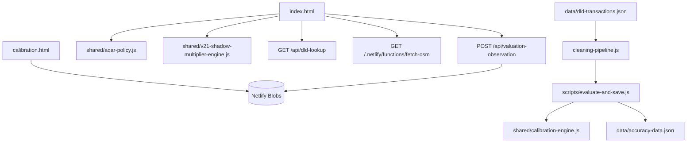

# MIAYAAR Developer Guide

## Valuation Intelligence Engine

**Version:** Technical Guide — 27 August 2026

**Scope:** The current `main` implementation, while preserving the existing AQAR internal contracts and identifiers.

> This guide describes the current implementation behavior. It is not a proposal to change the algorithms or calibration, and no current factor should be interpreted as a new methodological decision.

## 1. Overview

MIAYAAR is a static HTML, CSS, and Vanilla JavaScript platform deployed on Netlify. The public interface does not use React or a bundler. It relies on shared JavaScript files, while Netlify Functions enforce API boundaries and perform external-data access and storage operations.

The project has two calculation paths that must remain distinct:

| Path | Purpose | Main entry point |
|---|---|---|
| **Interactive browser path** | Evaluate a user property in the browser and display the result immediately. | `index.html` |
| **Batch / Accuracy path** | Re-evaluate DLD transactions and create official artifacts and diagnostics. | `scripts/evaluate-and-save.js` |

The paths share important rules, including property policy, calibration, DLD cleaning, and the Shadow engine. However, some values and valuation-method applicability differ between interactive and batch execution. Do not unify them automatically without a methodological decision and comparative tests.

## 2. Repository map

| Path | Responsibility |
|---|---|
| `index.html` | Public form, map, DLD/GIS calls, interactive calculation, and result rendering. |
| `calibration.html` | Administrator Calibration Console for loading, editing, and saving configuration. |
| `accuracy-dashboard.html` | Official Accuracy and diagnostic summaries. |
| `market-intelligence.html` | Market Intelligence indicators and context. |
| `export.html` | Public export flow. |
| `shared/aqar-policy.js` | Property types, method applicability, required fields, and irrelevant fields. |
| `shared/calibration-engine.js` | Income, Cost, and DCF calculations and weighted method combination. |
| `shared/aqar-calibration-defaults.js` | Default schema, property types, weights, and core factors. |
| `shared/calibration-validation.js` | Configuration, weights, Shadow, and numeric-leaf validation. |
| `shared/v21-shadow-multiplier-engine.js` | Isolated experimental multipliers for project, BUA/Plot, and renovation. |
| `shared/property-extra-fields.js` | Visibility and validation for Project, BUA, Plot, and Last Renovation fields. |
| `shared/evidence-state.js` | Evidence states: `ready`, `limited`, `insufficient`, and `unavailable`. |
| `shared/dld-evidence-cleaning.js` and `scripts/cleaning-pipeline.js` | DLD eligibility and cleaning. |
| `shared/comparable-diagnostics.js` | Comparable-level and dispersion diagnostics. |
| `shared/district-map-linking.js` | District-to-map-point and reverse matching. |
| `netlify/functions/` | APIs and access to DLD, GIS, and storage. |
| `scripts/` | Data fetching, cleaning, batch evaluation, diagnostics, and isolated experiments. |
| `tests/` | Node tests for sensitive contracts, APIs, and public behavior. |
| `data/` | Artifacts and data summaries; some files are official and protected. |

## 3. Runtime architecture



`netlify.toml` defines the Functions directory and adds a general redirect from `/api/*` to `/.netlify/functions/:splat`. The interface can therefore use `/api/calibration-config` and `/api/valuation-observation`, while some existing calls use the direct `/.netlify/functions/...` path.[1]

## 4. Property and method contracts

Property types are declared in `shared/aqar-policy.js` and `shared/aqar-calibration-defaults.js`. A new property type must not be added to only one file.

| Type | Interactive methods | Current batch methods |
|---|---|---|
| `apartment` | `sales-comparison`, `income`, `dcf` | `sales-comparison`, `income` |
| `villa` | `sales-comparison`, `income`, `cost`, `dcf` | `sales-comparison`, `income`, `cost` |
| `townhouse` | `sales-comparison`, `income`, `cost`, `dcf` | `sales-comparison`, `income`, `cost` |
| `office` | `sales-comparison`, `income`, `cost`, `dcf` | `sales-comparison`, `income`, `cost` |
| `retail` | `sales-comparison`, `income`, `cost`, `dcf` | `sales-comparison`, `income`, `cost` |
| `warehouse` | `sales-comparison`, `income`, `cost` | `sales-comparison`, `income`, `cost` |
| `land` | `sales-comparison`, `income` | `sales-comparison`, `income` |

`getApplicableMethods(propertyType, context)` uses the batch list only when `context === 'batch'`; every other context returns the interactive list. This detail matters when adding an endpoint or a new test.

`validatePropertyInput()` requires a supported property type and an area of at least `10` square metres. Other fields remain optional or irrelevant according to `PROPERTY_POLICY`.[2]

## 5. Interactive evaluation flow

The public flow in `index.html` proceeds as follows:

1. `collectPropertyData()` collects the form inputs and clears or hides fields that are irrelevant to the selected property type.
2. The user selects a District / Area, allowing the interface to update the map centre and nearby facilities.
3. **Load market data** sends the district, type, area, and available location context to DLD lookup.
4. The response is stored in `scrapedDistrictData` and classified through `shared/evidence-state.js`.
5. Sales Comparison, Income, Cost, and DCF are evaluated according to property type and available inputs.
6. Results are combined through the shared calibration-engine contract, after which the interactive path computes confidence and renders the result.
7. The Shadow engine computes a separate experimental value when enabled; it does not replace the official value.
8. If optional analytics consent is enabled, an observation is sent after evaluation. A storage failure does not hide the valuation result.

A stale result must not be retained after a new evaluation starts or new evidence is loaded for a different property. After changing important inputs, reload market data before interpreting the result.

## 6. Interactive valuation algorithms

### 6.1 Sales Comparison

The interactive approach starts from `avgPriceSqm` returned by DLD lookup or loaded market data:

```text
base = avgPricePerSqm × Total Area
base = min(base, sales.maxPricePerSqm × Total Area)
```

The available factors are then applied by the operational order in `salesComparisonApproach()`:

| Stage | Effect |
|---|---|
| Studio | Applies `noBedroomMultiplier` when an apartment has zero bedrooms. |
| Condition | Applies `conditionFactors[condition]`. |
| Age | Applies `max(minimumAgeMultiplier, 1 − age × ageDepreciation)`. |
| Features | Adds `features.length × area × featureBonusPerSqm`. |
| Finish | Applies `finishFactors[finishQuality]` when available. |
| View | Uses `calculateViewMultiplier()` for multiple views, secondary-view factor, and min/max bounds. |
| Floor | Applies `floorFactors[floorLevel]` when floor information is available. |
| Street | Applies `streetFactors[streetPosition]` when available. |
| Building | Applies `buildingConditionFactors[buildingCondition]`. |
| Furnished | Applies `furnishedFactors[furnishedStatus]`. |
| GIS | Multiplies the value when a GIS impact is available. |

This approach does not create a DLD-based price when a valid market value is unavailable. Evidence state is reported separately from the arithmetic.

### 6.2 Income Capitalization

The method requires a positive `annualRent`:

```text
expenses = annualExpenses || annualRent × expenseRate
NOI = annualRent × (1 − vacancyRate / 100) − expenses
value = NOI / (capRate / 100)
```

When `annualExpenses` is blank, the path uses `expenseRate` as an assumption. The interface may use consultancy vacancy and cap-rate data when available; otherwise it uses current calibration factors. If NOI is not positive, the method returns `null` in the interactive path or `NOT_APPLICABLE` in the shared engine.

### 6.3 Cost Approach

The interactive path does not use Cost for apartments or land. For applicable types:

```text
build = constructionCostPerSqm × area
land = supplied landValue
     || avgPriceSqm × area × landValueFromMarketShare
     || build × landValueFromBuildShare
age = clamp(currentYear − yearBuilt, 0, 50)
depreciation = min(maximumDepreciation, age × depreciationPerYear)
value = (land + build) × (1 − depreciation) × conditionFactor
```

The land-value source is significant: an explicitly supplied land value takes precedence over values derived from market share or construction share.

### 6.4 DCF

DCF is used only when it is applicable to the type and `annualRent` is positive. `currentValue` comes from `avgPriceSqm × area` when available, or from `annualRent / fallbackCapRate` otherwise. Rent and value are then projected year by year:

```text
NPV = −currentValue
for year = 1..years:
  rent = rent × (1 + rentGrowthRate)
  value = value × (1 + valueGrowthRate)
  NPV += rent × netOperatingIncomeRate / (1 + discountRate)^year
  if final year:
    NPV += value × terminalValueRate / (1 + discountRate)^years
result = NPV > 0 ? NPV : currentValue × negativeNpvFallback
```

The current difference between interactive and batch DCF applicability must be preserved until a methodological decision is made because their applicability lists differ.[2]

### 6.5 Method combination

`calculateWeightedValue()` maps the interactive method names to shared-engine keys and then calls `buildMethodResults()` and `combineMethodResults()`.

The combination excludes results that are not `APPLIED`, do not have a finite numeric value, or have zero weight. The combined value is a normalized weighted average over applied methods only:

```text
applied = results where status == APPLIED and weight > 0
value = Σ(result.value × methodWeight) / Σ(methodWeight)
```

This means that an applicable method may contribute nothing to a particular result when its required input is missing. It is recorded as `NOT_APPLICABLE` or `NOT_USED`, depending on the path, rather than being assigned a misleading zero value.[3]

## 7. DLD API and comparable search

### Endpoint

```http
GET /api/dld-lookup?district=Business%20Bay&propertyType=apartment&area=120
```

The Function also accepts the direct path `/.netlify/functions/dld-lookup`. The required parameters are `district`, `propertyType`, and `area`. The interface may pass `lat` and `lng` with the request, but the current handler does not use them in `adaptiveSearch`; the current search depends on district name, property type, and size category.

| Status | Behavior |
|---:|---|
| `200` with `found: true` | Usable comparable data was found. |
| `200` with `found: false` | No sufficient sample was found; no invented DLD price is created. |
| `400` | Missing parameter, unsupported type, or invalid area. |
| `405` | Non-GET method. |
| `429` | Rate limit exceeded, with `Retry-After`. |
| `502` or `503` | DLD source unavailable or returned invalid data. |

### Adaptive search

After loading the dataset and applying `applyAllFilters()`, the endpoint computes a size category and tries these levels:

| Level | Grouping condition |
|---|---|
| `district_size` | District + property type + size category, with flexible district-text matching. |
| `district_type` | District + property type, without size category. |
| `district_only` | District only, across property types. |

Each level tries `[30, 60, 90, 180, 365, 730, Infinity]` day windows and is accepted when at least five transactions are available. Price-per-square-metre values are time-adjusted using average monthly growth, then a weighted median is selected. The response includes `avgPricePerSqm`, `comparablePrices`, `count`, `timeWindow`, `confidence`, and `level`.

The endpoint uses a five-minute cache and allows at most 60 requests per client key within one minute, with protection against rate-limit-key growth. Do not remove these protections when adding a new call path.

## 8. DLD cleaning and the batch Accuracy path

`cleaning-pipeline.js` is the shared source of truth for cleaning functions. Do not duplicate these functions in a Function or another script. The current `applyAllFilters()` stages are:

1. Keep evidence-eligible records.
2. Exclude non-market procedures and keywords such as gift, inheritance, and mortgage.
3. Reject records with missing district, type, area, or sale price.
4. Check `area` against `procedureArea` within `0.5` to `2.0` when both exist.
5. Apply property-type area limits.
6. Derive `pricePerSqm` and reject invalid prices.
7. Remove outliers inside `district × propertyType` groups using log-IQR.
8. Exclude off-plan and non-ready statuses.
9. Remove duplicates using `propertyRef` and an approximate date/area/price key.
10. Exclude ultra-luxury records above the current thresholds.
11. Retain groups that pass the final minimum group-count gate.

`scripts/evaluate-and-save.js` builds lookup tables and leave-one-out medians, then selects batch comparables in this order:

```text
project + size   if count >= 3
project          if count >= minProject (retail=2, otherwise=5)
district + size  if count >= 5
district         if count >= 5
no result        otherwise
```

After selecting a group, the batch path applies consultancy, View, and GIS layers when available, then passes the value to the shared calibration engine to produce `methodResults`, `calibrationId`, and `assumptions`.

The batch path writes artifacts such as `market-data.json`, `dld-price-lookup.json`, `accuracy-data.json`, diagnostics, and client summaries. Do not run `npm run evaluate` during ordinary investigation; it is a write path and may rebuild artifacts.

## 9. GIS API

The direct path used by the interface is:

```http
GET /.netlify/functions/fetch-osm?lat=25.1855&lng=55.2604&radius=1000
```

`/api/fetch-osm` is also available through the general redirect. The Function accepts coordinates inside the supported Dubai service bounds and a radius between `100` and `5000` metres.

The Function uses:

- An internal seven-day cache with a maximum of 250 entries.
- Multiple Overpass servers with an overall timeout of approximately 20 seconds.
- Haversine distance calculations.
- Facility types such as Metro, Mall, Supermarket, School, Hospital, and Park.
- A weight per facility type and a score based on distance and count, with a score cap.

The response includes `facilities`, `pois`, `totalScore`, `count`, `lat`, `lng`, `radius`, and `source`. GIS failure is represented explicitly; missing GIS data must not be converted into invented facilities or an implicit premium.[4]

## 10. Calibration configuration API

### Public GET

```http
GET /api/calibration-config
```

Returns the active configuration without exposing the administrator token. Adding `?history=true` requests history as well but requires Authorization.

### GET history

```http
GET /api/calibration-config?history=true
Authorization: Bearer <admin-token>
```

### POST save

```http
POST /api/calibration-config
Authorization: Bearer <admin-token>
Content-Type: application/json

{
  "config": {
    "propertyTypes": {
      "villa": {
        "weights": {
          "sales-comparison": 0.50,
          "income": 0.25,
          "cost": 0.15,
          "dcf": 0.10
        }
      }
    }
  }
}
```

The values above are structural examples only, not calibration recommendations. On POST:

1. Defaults and the current configuration are read.
2. `deepMergeKnown()` merges known keys only.
3. A new `configId` is created as `cal-${Date.now()}`.
4. The active status, update time, and engine version are set.
5. `validateConfig()` runs.
6. A valid configuration is stored in Netlify Blobs under store `aqar-calibration` and key `active`.
7. A summary is added to `history/index`, and a detailed copy is stored under `history/<configId>`.
8. History is trimmed to the latest 50 entries.

| Status | Meaning |
|---:|---|
| `200` | Successful read or save. |
| `400` | Invalid calibration configuration. |
| `401` | Missing or invalid token for history/POST. |
| `405` | Unsupported method. |
| `503` | POST is impossible because `AQAR_ADMIN_TOKEN` is not configured. |
| `500` | Storage read or write failure. |

Never print the token in logs, use it in local tests, or add a new administrator endpoint without reviewing the authentication boundary.

## 11. Validation contract

`validateConfig()` checks:

- `schemaVersion === 1`.
- All seven property types are present.
- Every weight is numeric and between `0` and `1`.
- Applicable weights for each property type sum to `1.0` within a tolerance of `0.000001`.
- A non-applicable method has weight zero.
- `applicableMethods` contains no unknown method.
- GIS numeric leaves are finite.
- Shadow enablement is boolean, multipliers are positive, and bands are non-empty and ordered.
- Project multipliers and band multipliers are positive.

`deepMergeKnown()` ignores unknown keys instead of passing them into the configuration. It treats `projectMultipliers` specially so dynamic project keys can be merged without replacing the entire object.[5]

## 12. Shadow v2.1

`v21-shadow-multiplier-engine.js` is an isolated experimental path and does not change the official value when `enabled` is false. Project multipliers apply to Apartment, Villa, and Townhouse; BUA/Plot applies to Villa and Townhouse; renovation applies to the three residential types.

When enabled, the engine computes:

```text
combinedRaw = projectBuilding × buaPlotArea × lastRenovation
combined = clamp(combinedRaw, combinedMinimumMultiplier, combinedMaximumMultiplier)
```

A Project multiplier is applied only when the project name is a verified DLD suggestion and `projectEvidenceCount` reaches the minimum threshold. The BUA/Plot band resolves `bua / plotArea`, and the renovation band resolves `currentYear - lastRenovationYear`.

`compute()` returns `multiplier`, `rawMultiplier`, `factors`, `applied`, `skipped`, and `bounds`. Preserve skip reasons in the trace; they are part of experiment explainability, not an error to hide.[6]

## 13. Observation API

Observations are optional and must not enter Accuracy or calibration history. The path is:

```http
POST /api/valuation-observation
Content-Type: application/json
```

The endpoint requires:

- POST only.
- Same-origin when `origin` and `host` headers are available.
- A body no larger than `32 KiB`.
- `consent.analytics === true`.
- A supported property type and a non-empty district.
- Valid and applicable year and extra-field values.
- Verified-project validation against `dld-project-evidence-index.json` when `verified-dld` is used.
- Positive `baselineValue` and `shadowValue`.
- `evidenceState` from the known enum.

The payload is normalized into schema `v2.1-observation-1` and stored in Netlify Blobs store `aqar-input-observations` under:

```text
events/YYYY/MM/<observationId>.json
```

Names, email addresses, phone numbers, Authorization headers, and tokens are not stored. Without explicit consent, the endpoint must reject the request before storage.[7]

## 14. Evidence and diagnostics

`evidence-state.js` separates evidence availability from value calculation. Do not assume that the word confidence has the same meaning across all paths; DLD lookup, the result interface, and Market Intelligence may use different indicators.

`comparable-diagnostics.js` selects the highest qualifying comparable level from:

```text
project_size → project → district_size → district
```

It returns counts, qualification flags, price-per-square-metre summaries, and dispersion. Flags such as `moderate_peer_dispersion`, `high_peer_dispersion`, and `land_xlarge` are diagnostic and do not change the current value.[8]

Auditable results should include at least:

| Field | Purpose |
|---|---|
| `calibrationConfigId` | Identifies the calibration version used. |
| `engineVersion` | Identifies the valuation-logic version. |
| `valuationMethods` or `methodResults` | Shows applied and non-applied methods. |
| `calibrationAssumptions` or `assumptions` | Separates assumptions from source facts. |
| `gisMultiplier` and `viewMultiplier` | Tracks location and view adjustments. |
| `comparableDiagnostics` | Explains comparable level and quality. |

## 15. Development commands

```bash
npm ci
npm test
npm run build
npm run validate-artifacts
npm run validate-dld
npm run mobile-smoke
npm run calibration-impact-matrix
npm run reproducibility-drift
```

| Command | Notes |
|---|---|
| `npm test` | Runs Node tests in `tests/*.test.js`. |
| `npm run build` | There is no build step; it prints a confirmation for the static project. |
| `npm run validate-artifacts` | Checks DLD and Accuracy provenance and integrity. |
| `npm run validate-dld` | Checks DLD cleaning and prevents rejected-record leakage. |
| `npm run mobile-smoke` | Runs Playwright against Pixel 5 and iPhone 13 emulation. |
| `npm run calibration-impact-matrix` | Read-only local impact matrix for weights and factors; no POST or save. |
| `npm run reproducibility-drift` | Isolated reproducibility and date-drift experiment. |
| `npm run evaluate` | Artifact-writing path; do not use for quick investigation. |
| `npm run fetch` | May fetch and rebuild data; review the script before running it. |

Before a PR, run tests, syntax checks for inline JavaScript, `git diff --check`, and the artifact guard. When changing an API or interface, add a contract test instead of relying only on manual inspection.

## 16. Tests and change rules

Project tests are organized by contract, including:

| File | Scope |
|---|---|
| `calibration-engine.test.js` | Effect of weights and Income factors on value. |
| `calibration-config.test.js` | Validation, 100% rule, and Shadow configuration. |
| `calibration-matrix.test.js` | Property-type method applicability and interface policy. |
| `calibration-impact-matrix.test.js` | Local test isolation and artifact protection. |
| `dld-lookup-validation.test.js` and `dld-lookup-history.test.js` | DLD input and time-window behavior. |
| `dld-evidence-cleaning.test.js` | DLD eligibility and cleaning. |
| `v21-shadow-multiplier-engine.test.js` | Project, BUA/Plot, renovation, and bounds. |
| `valuation-observation.test.js` | Consent, same-origin, schema, and extra fields. |
| `security-headers-a11y.test.js` | Headers, skip links, and main landmarks. |
| `public-ui-regression.test.js` | Public interface and result behavior. |

When changing the evaluator or calibration, state whether the change affects new valuations only or rebuilds Accuracy. Do not edit `data/accuracy-data.json` or `data/dld-transactions.json` manually while fixing a test, and do not use an Accuracy result to justify a new factor without independent temporal and segment validation.

## 17. Security and deployment rules

The Admin token must remain in environment secrets only. Do not use it in local fixtures or CI output. Do not enable the legacy scraper endpoints (`scrape.js` and `scrape-sold.js`); they are outside the current product path and disabled by default.

When changing a Function, verify the method allow-list, rate limit, body-size limit, CORS/origin policy, and non-revealing error messages. When changing the data pipeline, check raw checksums, the cleaning report, provenance, and official artifact hashes before and after execution.

The recommended PR flow is a small branch, local test, limited commit, PR, CI and Deploy Preview, mergeability review, squash merge, and deployment of the current site only when required. Do not create another Netlify site or hostname for this project.

## 18. Known developer limitations

The interactive and batch paths are not computationally identical in every detail. The DCF and method-list differences are documented and require a decision before unification. Some artifact weighted medians depend on the current date, so date drift can appear when the evaluation date is not fixed. District map points are representative rather than legal boundaries, and external GIS data can fail.

Project, BUA, Plot, and Last Renovation fields are part of experimental v2.1. Shadow is neutral by default and does not change the official value. Do not rename `area` or `procedureArea` as BUA or Plot without a documented source, and do not introduce synthetic data into Accuracy.

## References

[1]: https://github.com/Hichemorca/aqar-evaluate-engine/blob/main/netlify.toml "Netlify routing and function configuration"

[2]: https://github.com/Hichemorca/aqar-evaluate-engine/blob/main/shared/aqar-policy.js "Property policy and method applicability"

[3]: https://github.com/Hichemorca/aqar-evaluate-engine/blob/main/shared/calibration-engine.js "Shared calibration valuation engine"

[4]: https://github.com/Hichemorca/aqar-evaluate-engine/blob/main/netlify/functions/fetch-osm.js "GIS and OpenStreetMap Netlify Function"

[5]: https://github.com/Hichemorca/aqar-evaluate-engine/blob/main/shared/calibration-validation.js "Calibration configuration validation"

[6]: https://github.com/Hichemorca/aqar-evaluate-engine/blob/main/shared/v21-shadow-multiplier-engine.js "Experimental v2.1 Shadow multiplier engine"

[7]: https://github.com/Hichemorca/aqar-evaluate-engine/blob/main/netlify/functions/valuation-observation.js "Valuation observation API"

[8]: https://github.com/Hichemorca/aqar-evaluate-engine/blob/main/shared/comparable-diagnostics.js "Comparable diagnostics contract"
